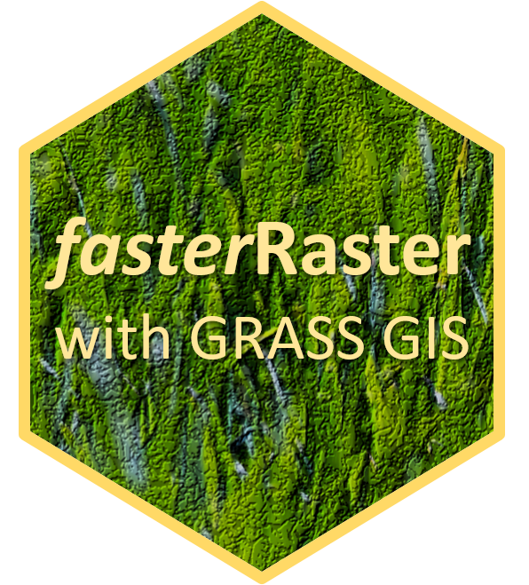

# fasterRaster
<!-- badges: start -->

<!-- badges: end -->

Faster raster processing in **R** using **GRASS GIS**

  

**fasterRaster** uses the stand-alone installer of Open Source Geospatial's <a href="https://grass.osgeo.org/rgrass/">**GRASS GIS**</a> Version 8 to speed up some commonly used raster and vector operations. Most of these operations can be done using the **raster** or newer **terra** packages by Robert Hijmans, or the **rgeos** or newer **sf** packages.  However, when the input raster or vector is very large in memory, in some cases functions in those packages can take a long time and fail. The **fasterRaster** package attempts to address these problems by calls to **GRASS** which is faster. Please note that **terra** and **sf** may be faster and thus the better solution for functions that this package implements. However, in some cases **fasterRaster** is still faster!

**fasterRaster** makes heavy use of the <a href="https://cran.r-project.org/package=rgrass">**rgrass**</a> package by Roger Bivand and others, the <a href="https://cran.r-project.org/package=rgrass">**terra**</a> package by Robert Hijmans, the <a href="https://cran.r-project.org/package=sf">**sf**</a> package by Edzer Pebesma and others, and of course <a href="https://grass.osgeo.org/">**GRASS GIS**</a>, so is heavily indebted to all of these creators

# Getting started #

## Installation ###

You can install **fasterRaster** from CRAN.  Alternatively, you can get the latest development version from **GitHub** using:  

`remotes::install_github('adamlilith/fasterRaster', dependencies=TRUE)`  

To use **fasterRaster** you will also need to install [GRASS version 8+](https://grass.osgeo.org/) on your operating system. You will need to use the stand-alone installer, not the Open Source Geospatial (OS Geo) installer.

## The `grassDir` argument

You will need to know the install path for **GRASS** and supply it to functions through an argument named `grassDir`. There are two ways to supply this argument. First, you can pass this to each function that needs it. For example, you can call functions like this:  

`grassDir <- 'C:/Program Files/GRASS GIS 8.2' # PC`  
`grassDir <- "/Applications/GRASS-8.2.app/Contents/Resources" # Mac`  
`grassDir <- '/usr/local/grass' # Linux... maybe`  

`output <- fasterSomething(various_input_arguments, grassDir = grassDir)`  

This is fine if you need to just run a few functions, but it can be cumbersome. The other way is to set an "option" equal to the install path:  

`options(grassDir = 'C:/Program Files/GRASS GIS 8.2') # PC`  
`options(grassDir = "/Applications/GRASS-8.2.app/Contents/Resources") # Mac`  
`options(grassDir = '/usr/local/grass') # Linux`  

Now, whenever you run a **fasterRaster** function that needs `grassDir`, it will just look for it there. So you can just do:

`output <- fasterSomething(various_input_arguments)`  

...which is much simpler.  

## An example ##

Let's get started! We'll do a simple operation in which we calculate the distance to rivers (represented by a spatial lines vector object) and burn the distance values into a raster. To do this, we'll be using maps representing the middle of the eastern coast of Madagascar. We will also use the `terra` and `sf` packages for raster and spatial vector support, respectively (**fasterRaster** also works with `terra`'s `SpatVector` class, and in fact "prefers" it).

`library(fasterRaster)`  
`library(terra)`  
`library(sf)`  

Please use/change the appropriate line to fit your installation path for **GRASS**:  
`options(grassDir = 'C:/Program Files/GRASS GIS 8.2') # PC`  
`options(grassDir = "/Applications/GRASS-8.2.app/Contents/Resources") # Mac`  
`options(grassDir = '/usr/local/grass') # Linux`  

`# load a raster to serve as a template and spatial vector file with rivers`  
`madForest2000 <- fasterData('madForest2000')`  
`data(madRivers)`  

`# calculate and plot distance to rivers`  
`distToRiver <- fasterVectToRastDistance(madForest2000, madRivers)`  
`plot(distToRiver, main='Distance to Rivers (m)')`  
`plot(madRivers, col='blue', add=TRUE)`  

`# calculate quantiles of distance to rivers`  
`quants <- fasterQuantile(distToRiver, probs=c(0.05, 0.5, 0.95))`  
`quants`  

## Chaining functions for speed ##
That was easy enough. Under the hood, many of the `faster` functions are:  
1) Starting a **GRASS** session;  
2) Importing a raster and/or vector to that session;  
3) Doing the requested operation; and then
4) Exporting the raster/vector output to**R**.  

Note that you really probably aren't interested importing and exporting things into/out of **GRASS** (steps 2 and 4), but they create a computing overhead.  To obviate this, it is possible to "chain" functions together so that they use the same **GRASS** session by keeping the rasters/vectors in **GRASS** and then exporting them when you need them in the end.  

Here's an example in which we'll chain the `fasterVectToRastDistance` and `fasterQuantile` functions together.  

`distToRiver <- fasterVectToRastDistance(madForest2000, madRivers, grassToR=FALSE, outGrassName='distToVect')`  
`quants <- fasterQuantile(rast='distToVect', probs=c(0.05, 0.5, 0.95))`  
`quants`  

The first function imports the raster and vector, and does its calculations, but does not export the output raster to **R**. Rather, the output raster stays in the **GRASS** session and is named `distToVect`. We do not need to spend time exporting it back to **R**. In the second function the first argument is `distToVect`, the name of the raster we just created in the first function. This tells the second function to look in the **GRASS** session for the raster, not in**R**. If we had instead argument set `rast` in the second function equal to an actual raster, then the function would have imported the raster into a **GRASS** session, which takes some time to do.

You can see that by chaining a series of **fasterRaster** functions together, the process can be made faster because all of the operations are done in **GRASS** with less back-and-forth between **GRASS** and **R**.  The one exception to this is that a few **fasterRaster** functions do not use **GRASS** (e.g., `fasterFragmentation`), so you can't use this trick.

## The generic `faster()` function ##
The `faster` function is a generic wrapper for **GRASS** modules. You can use it to call many of the modules in **GRASS**.  It may not always work, but it simplifies the task of initiating a **GRASS** instance, importing the raster/vector, and executing the call:

`madElev <- fasterData('madElev')`  
`latRast <- faster('r.latlong', rast=madElev, outType='rast', flags=c('quiet', 'overwrite'))`  
`longRast <- faster('r.latlong', rast=madElev, outType='rast', flags=c('quiet', 'overwrite', 'l'))`  

By the way, this is the same as:

`ll <- fasterLongLatRasts(madElev)`

However, you can use `faster` to call **GRASS** modules that do not have a dedicated functon in **fasterRaster**, so `faster` is very flexible!

## Chaining with the `faster()` function ##

Here is an example of chaining with the `faster` function. The second function uses the **GRASS** session initiated by the first function. It then uses the raster created in the **GRASS** session by the first function as the input for its module.

`latRast <- faster('r.latlong', rast=madElev, outType='rast', flags=c('quiet', 'overwrite'), outGrassName='lat')}`  
`longRast <- faster('r.latlong', input='lat', outType='rast', flags=c('quiet', 'overwrite', 'l'))}`  

Here, we used the product of the first `faster` call, which is named `'lat'`, as the input to the second `faster` call. Note that we could have also used `'madElev'` as the input to the second, since it was also already in **GRASS**.

## Saving rasters ##

For some reason, if you create or export a raster to **GRASS**, then import it back to `R`, saving it using **terra**'s `writeRaster` function automatically forces the `datatype` of the raster to a low-bit integer. As a result, values are truncated to integers and forced to a specific range (or coerced to `NA`). You can overcome this simply by saving these rasters using, for example:

`writeRaster(rasterToSave, 'C:/pathToSave/fileName.tif', datatype='FLT4S')` or  
`writeRaster(rasterToSave, 'C:/pathToSave/fileName.tif', datatype='FLT8S')`

Here, the important part is the `datatype` argument, which in these two examples says to save the raster values as a 32-bit or 64-bit floating point values that are signed (can be negative or positive). Alternatively, you can also use these functions as shorthand to save in 32- or 64-bit signed, floating format:

`writeRaster4(rasterToSave, 'C:/pathToSaveTo/fileName.tif')`  
`writeRaster8(rasterToSave, 'C:/pathToSaveTo/fileName.tif')`

You can also save rasters directly from a `GRASS` session using:

`fasterWriteRaster(rasterNameInGrass, 'pathAndFileName.tif')`

# Functions #

### Getting help
* Typing `?fasterRaster` will pull up a table of package contents (much like this) plus a quick-start guide.
* `fasterHelp`: Find equivalent functions in **fasterRaster**, **GRASS**, **terra**, and **sf**.

### *Faster* functions that do operations on rasters
* `fasterApp`: Apply user-defined function to one or more rasters (using **GRASS**; see also `fasterFocal`).
* `fasterBufferRast`: Add buffer to cells in a raster.
* `fasterContour`: Calculate contour vectors from a raster.
* `fasterConvertDegree`: Convert degrees from "0 = east and 90 = north" format to "0 = north and 90 = east" format.
* `fasterCropRast`: Crop a raster to the region of overlap with another raster or vector.
* `fasterFocal`: Faster focal calculations (see also `fasterApp`).
* `fasterFragmentation`: Fragmentation indices following Riitters et al. (2000 Conservation Ecology 4:3).
* `fasterHorizon`: Horizon angle height from a DEM.
* `fasterInfo`: Information on one or more rasters or vectors in a **GRASS** session.
* `fasterLongLatRasts`: Create rasters with values equal to cell longitude and latitude.
* `fasterMosaic`: Combine rasters that do not overlap perfectly.
* `fasterProjectRast`: Project and resample raster.
* `fasterQuantile`: Quantiles of values in a raster.
* `fasterRast`: Export raster to an active **GRASS** session.
* `fasterRastDistance`: Distance from cells with `NA`s to closest non-`NA` cell (or the inverse of this).
* `fasterSun`: Solar irradiance and radiance.
* `fasterFractalRast`: Generate a raster with a fractal pattern.
* `fasterTerrain`: Slope, aspect, and curvature.
* `fasterTWIdx`: Topographic wetness index.
* `fasterTrimRast`: Remove all rows and columns of a raster that are entirely NA.
* `fasterVectorize`: Convert raster to spatial points, lines, or polygons.
* `importFromGrass`: Import a raster or vector from a **GRASS** session into `R`.

### *Faster* functions that operate on vectors
* `fasterBufferVect`: Create a buffer around a spatial vector.
* `fasterConvHull`: Minimum convex hull around a spatial vector.
* `fasterDelaunay`: Delauney triangulation for points.
* `fasterInfo`: Information on one or more rasters or vectors in a **GRASS** session.
* `fasterProjectVect`: Project a spatial vector.
* `fasterRasterize`: Convert vector to a raster.
* `fasterVect`: Export spatial vector to an active **GRASS** session.
* `fasterVoronoi`: Voronoi diagrams for points or polygons.
* `fasterWriteVector`: Save one or more vectors to disk directly from a **GRASS** session.
* `importFromGrass`: Import a raster or vector from a **GRASS** session into `R`.

### *Faster* functions that operate on rasters and vectors simultaneously
* `faster`: Generic call to a **GRASS** module.
* `fasterVectToRastDistance`: Distance between raster cells and a vector.

### Generic *faster* function for rasters and/or vectors
* `faster`: Generic call to a **GRASS** module.

### Utility functions
* `compareFloat`: Compare values accounting for differences due to floating point precision.
* `fasterCRS`: Information on the coordinate reference system in the current **GRASS** session.
* `fasterExt`: Spatial extent of a **GRASS** session.
* `fasterLs`: Names of all rasters and/or vectors in a **GRASS** session.
* `fasterRm`: Remove raster(s) and/or vector(s) from a **GRASS** session.
* `initGrass`: Initialize a **GRASS** session using a raster or vector as a template.
* `writeRaster4` and `writeRaster8`: Save a raster exported from **GRASS** to disk.
* `importFromGrass`: Import a raster or vector from a **GRASS** session into `R`.

### Functions affecting `GRASS` "regions" (rarely used by most users):
* `regionDim`: Number of rows and columns of a region.
* `regionExt`: Extent of a region.
* `regionNcell`: Number of cells of a region.
* `regionNcol`: Number of columns of a region.
* `regionNrow`: Number of rows of a region.
* `regionRes`: Spatial resolution of a region.
* `regionResample`: Change resolution of a region.
* `regionReshape`: Change extent and resolution of a region using a raster or vector as a template.
* `regionResize`: Change extent of a region.
* `setGrassVer`: Sets version of **GRASS** for use by `fasterHelp()` function

### Data
All spatial data represents features in a portion of eastern Madagascar.
* `fasterData`: Load any of the spatial datasets
* `madCoast0` and `madCoast4`: Outlines of a portion of eastern Madagascar
* `madChelsa`: Bioclimatic rasters for a portion of eastern Madagascar
* `madDypsis`: Records of the genus *Dypsis* (slender, evergreen palms)
* `madElev`: Elevation raster
* `madElevAnt: Elevation raster for the Antanambe Commune of Madagascar
* `madElevMan: Elevation raster for the Manompana Commune of Madagascar
* `madForest2000` and `madForest2014`: Forest cover rasters for 2000 and 2014
* `madRivers`: Major rivers

# Citation #
As of December, 2022, there is not a package-specific citation for **fasterRaster**, but the package was first used in:

Morelli*, T.L., Smith*, A.B., Mancini, A.N., Balko, E. A., Borgenson, C., Dolch,R., Farris, Z., Federman, S., Golden, C.D., Holmes, S., Irwin, M., Jacobs,R.L., Johnson, S., King, T., Lehman, S., Louis, E.E. Jr., Murphy, A.,Randriahaingo, H.N.T., Lucien,Randriannarimanana, H.L.L.,Ratsimbazafy, J.,Razafindratsima, O.H., and Baden, A.L. 2020. The fate of Madagascar’s rainforest habitat.  *Nature Climate Change* 10:89-96. * Equal contribution DOI: <a href="https://doi.org/10.1038/s41558-019-0647-x">https://doi.org/10.1038/s41558-019-0647-x</a>.

*Abstract*. Madagascar has experienced extensive deforestation and overharvesting, and anthropogenic climate change will compound these pressures. Anticipating these threats to endangered species and their ecosystems requires considering both climate change and habitat loss effects. The genus Varecia (ruffed lemurs), which is composed of two Critically Endangered forest-obligate species, can serve as a status indicator of the biodiverse eastern rainforest of Madagascar. Here, we combined decades of research to show that the suitable habitat for ruffed lemurs could be reduced by 29–59% from deforestation, 14–75% from climate change (representative concentration pathway 8.5) or 38–93% from both by 2070. If current protected areas avoid further deforestation, climate change will still reduce the suitable habitat by 62% (range: 38–83%). If ongoing deforestation continues, the suitable habitat will decline by 81% (range: 66–93%). Maintaining and enhancing the integrity of protected areas, where rates of forest loss are lower, will be essential for ensuring persistence of the diversity of the rapidly diminishing Malagasy rainforests.

~ Adam
