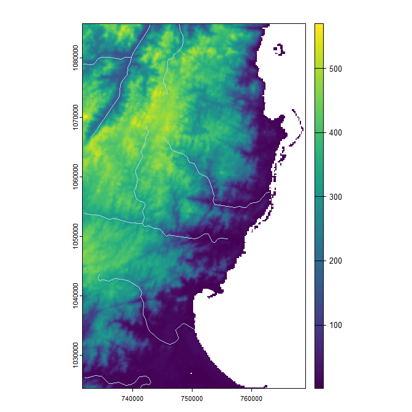

```{r, include = FALSE}
knitr::opts_chunk$set(
  collapse = TRUE,
  comment = "#>"
)
fig.path = 'man/figures/'
```
**fasterRaster** interfaces with **GRASS** to process rasters and spatial vector data. It is intended as an add-on to the **terra** and **sf** packages, and relies heavily upon them. For most rasters and vectors that are small or medium-sized in memory/disk, those packages will almost always be faster. They may also be faster for very large objects.  But when they aren't, **fasterRaster** can step in.

## Installing **fasterRaster**

You probably already have **fasterRaster** installed on your computer, but if not, you can install the latest release version from CRAN using:
```{r install, eval = FALSE}
install.packages("fasterRaster")
```
or the latest development version using:
```{r install_dev, eval = FALSE}
remotes::install_github("adamlilith/fasterRaster", dependencies = TRUE)
```
(You may need to install the `remotes` package first.)

## Installing **GRASS**

**fasterRaster** uses **GRASS** to do its operations. You will need to install **GRASS** using the "stand-alone" installer, available through the [GRASS](https://grass.osgeo.org/). *Be sure to use the "stand-alone" installer, not the "OSGeo4W" installer!*

Optional: A few functions in **fasterRaster** require **GRASS** "addon" modules, which do not come bundled with **GRASS**. You do not need to install these addons if you do not use functions that call them. A list of functions that require addons can be seen in the "addons" vignette (in **R**, use `vignette("addons", package = "fasterRaster")`). This vignette also explains how to install addons.

## Starting a **fasterRaster** session

I recommend attaching the **data.table**, **terra**, and **sf** packages before attaching **fasterRaster** package to avoid function conflicts. The **data.table** package is not required, but you most surely will use at least one of the other two.
```{r packages}
library(terra)
library(sf)
library(data.table)
library(fasterRaster)
```
To begin, you need to tell **fasterRaster** the full file path of the folder where **GRASS** is installed on your system. Where this is well depend on your operating system and the version of **GRASS** installed.  Three examples below show you what this might look like, but you may need to change the file path to match your case:

```{r grassDir_examples, eval = FALSE}
grassDir <- "C:/Program Files/GRASS GIS 8.4" # Windows
grassDir <- "/Applications/GRASS-8.4.app/Contents/Resources" # Mac OS
grassDir <- "/usr/local/grass" # Linux
```
```{r grassDir, echo = FALSE}
grassDir <- "C:/Program Files/GRASS GIS 8.4" # Windows
```
To tell **fasterRaster** where **GRASS** is installed, use the `faster()` function:

```{r faster_grassDir, eval = FALSE}
faster(grassDir = grassDir)
```
You can also use the [`faster()`](https://adamlilith.github.io/fasterRaster/reference/faster.html) function to set options that affect how **fasterRaster** functions run. This includes setting the amount of maximum memory and number of computer cores allocated to operations.

Importantly, some **fasterRaster** functions require addons (**GRASS** modules that are optional and are not included with teh **GRASS** download). To see how to set up addons so functions that use them can operate, see `vignette("addons", package = "fasterRaster").

## Importing spatial objects into **fasterRaster** `GRaster`s and `GVector`s

In **fasterRaster**, rasters are called `GRaster`s and vectors are called `GVector`s. The easiest (but not always fastest) way to start using a `GRaster` or `GVector` is to convert it from one already in **R**. In the example below, we use a raster that comes with the **fasterRaster** package. The raster represents elevation of a portion of eastern Madagascar. We first load the `SpatRaster` using [`fastData()`](https://adamlilith.github.io/fasterRaster/reference/fastData.html), a helper function for loading example data objects that come with the **fasterRaster** package.
```{r madElev, eval = FALSE}
madElev <- fastData("madElev") # example SpatRaster
madElev

class       : SpatRaster 
dimensions  : 1024, 626, 1  (nrow, ncol, nlyr)
resolution  : 59.85157, 59.85157  (x, y)
extent      : 731581.6, 769048.6, 1024437, 1085725  (xmin, xmax, ymin, ymax)
coord. ref. : Tananarive (Paris) / Laborde Grid 
source      : madElev.tif 
name        : madElev 
min value   :       1 
max value   :     570
```

Now, we do the conversion to a `GRaster` and a `GVector` using [`fast()`](https://adamlilith.github.io/fasterRaster/reference/fast.html). This function can create a `GRaster` or `GVector` from a `SpatRaster` or a file representing a raster.
```{r elev, eval = FALSE}
elev <- fast(madElev)
elev

class       : GRaster
topology    : 2D 
dimensions  : 1024, 626, NA, 1 (nrow, ncol, ndepth, nlyr)
resolution  : 59.85157, 59.85157, NA (x, y, z)
extent      : 731581.552, 769048.635, 1024437.272, 1085725.279 (xmin, xmax, ymin, ymax)
coord ref.  : Tananarive (Paris) / Laborde Grid 
name(s)     : madElev 
datatype    : integer 
min. value  :       1 
max. value  :     570
```

Converting rasters and vectors that are already in **R** to `GRaster`s usually takes more time than loading them directly from disk. To load from disk, simply replace the first argument in `fast()` with a string representing the folder path and file name of the raster you want to load into the session. For example, you can do:

```{r elev_from_file, eval = FALSE}
rastFile <- system.file("extdata", "madElev.tif", package = "fasterRaster")
elev2 <- fast(rastFile)
```

Now, let's create a `GVector`. The `fast()` function can take a `SpatVector` from the **terra** package, an `sf` object from the **sf** package, or a string representing the file path and file name of a vector file (e.g., a GeoPackage file or a shapefile).
```{r madRivers, eval = FALSE}
madRivers <- fastData("madRivers") # sf vector
madRivers

Simple feature collection with 11 features and 5 fields
Geometry type: LINESTRING
Dimension:     XY
Bounding box:  xmin: 731627.1 ymin: 1024541 xmax: 762990.1 ymax: 1085580
Projected CRS: Tananarive (Paris) / Laborde Grid
First 10 features:
       F_CODE_DES          HYC_DESCRI      NAM ISO     NAME_0                       geometry
1180 River/Stream Perennial/Permanent MANANARA MDG Madagascar LINESTRING (739818.2 108005...
1185 River/Stream Perennial/Permanent MANANARA MDG Madagascar LINESTRING (739818.2 108005...
1197 River/Stream Perennial/Permanent      UNK MDG Madagascar LINESTRING (747857.8 108558...
1216 River/Stream Perennial/Permanent      UNK MDG Madagascar LINESTRING (739818.2 108005...
1248 River/Stream Perennial/Permanent      UNK MDG Madagascar LINESTRING (762990.1 105737...
1256 River/Stream Perennial/Permanent      UNK MDG Madagascar LINESTRING (742334.2 106858...
1257 River/Stream Perennial/Permanent      UNK MDG Madagascar LINESTRING (731803.7 105391...
1264 River/Stream Perennial/Permanent      UNK MDG Madagascar LINESTRING (755911.6 104957...
1300 River/Stream Perennial/Permanent      UNK MDG Madagascar LINESTRING (731871 1044531,...
1312 River/Stream Perennial/Permanent      UNK MDG Madagascar LINESTRING (750186.1 103441...
```

```{r rivers, eval = FALSE}
rivers <- fast(madRivers)
rivers

class       : GVector
geometry    : 2D lines 
dimensions  : 11, 11, 5 (geometries, sub-geometries, columns)
extent      : 731627.0998, 762990.1321, 1024541.23477, 1085580.45359 (xmin, xmax, ymin, ymax)
coord ref.  : Tananarive (Paris) / Laborde Grid 
names       :   F_CODE_DES      HYC_DESCRI      NAM   ISO     NAME_0 
type        :        <chr>           <chr>    <chr> <chr>      <chr> 
values      : River/Stream Perennial/Perm~ MANANARA   MDG Madagascar 
              River/Stream Perennial/Perm~ MANANARA   MDG Madagascar 
              River/Stream Perennial/Perm~      UNK   MDG Madagascar 
              (and 8 more rows) 
```

## Operations on `GRaster`s and `GVector`s

You can do operations on `GRaster`s and `GVector`s as if they were `SpatRaster`s, `SpatVector`s, and `sf` objects. For example, you plot them as if the were any other spatial object:
```{r how_to_plot, eval = FALSE}
plot(elev)
plot(rivers, col = 'lightblue', add = TRUE)
```


You can use mathematical operators and functions:

```{r multiplication, eval = FALSE}
elev_feet <- elev * 3.28084
elev_feet

class       : GRaster
topology    : 2D 
dimensions  : 1024, 626, NA, 1 (nrow, ncol, ndepth, nlyr)
resolution  : 59.85157, 59.85157, NA (x, y, z)
extent      : 731581.552, 769048.635, 1024437.272, 1085725.279 (xmin, xmax, ymin, ymax)
coord ref.  : Tananarive (Paris) / Laborde Grid 
name(s)     :    layer 
datatype    :   double 
min. value  :   3.2808 
max. value  : 1870.056
```

```{r log, eval = FALSE}
log10_elev <- log10(elev)
log10_elev

class       : GRaster
topology    : 2D 
dimensions  : 1024, 626, NA, 1 (nrow, ncol, ndepth, nlyr)
resolution  : 59.85157, 59.85157, NA (x, y, z)
extent      : 731581.552, 769048.635, 1024437.272, 1085725.279 (xmin, xmax, ymin, ymax)
coord ref.  : Tananarive (Paris) / Laborde Grid 
name(s)     :              log 
datatype    :           double 
min. value  :                0 
max. value  : 2.75587485567249
```

You can also use the many **fasterRaster** functions. In general, these functions have the same names as their **terra** counterparts and often the same arguments. Note that even many **terra** and **fasterRaster** functions have the same name, they do not necessarily produce the exact same output. Much care has been taken to ensure they do, but sometimes there are multiple ways to do the same task, so choices made by the authors of **terra** and **GRASS** can lead to differences.

The following code 1) creates a raster where cell values reflect the distance between them and the nearest river; b) makes a buffer around the rivers; then c) plots the output:
```{r distance_buffers, eval = FALSE}
dist <- distance(elev, rivers)
dist

class       : GRaster
topology    : 2D 
dimensions  : 1024, 626, NA, 1 (nrow, ncol, ndepth, nlyr)
resolution  : 59.85157, 59.85157, NA (x, y, z)
extent      : 731581.552, 769048.635, 1024437.272, 1085725.279 (xmin, xmax, ymin, ymax)
coord ref.  : Tananarive (Paris) / Laborde Grid 
name(s)     :         distance 
datatype    :           double 
min. value  :                0 
max. value  : 21310.9411762729 
```
```{r buffer, eval = FALSE}

river_buff <- buffer(rivers, 2000)
river_buff

class       : GVector
geometry    : 2D polygons 
dimensions  : 1, 5, 0 (geometries, sub-geometries, columns)
extent      : 729629.19151, 764989.97343, 1022544.92079, 1087580.24979 (xmin, xmax, ymin, ymax)
coord ref.  : Tananarive (Paris) / Laborde Grid 

```
```{r plot_rivers_buffer, eval = FALSE}
plot(dist)
plot(rivers, col = 'lightblue', add = TRUE)
plot(river_buff, border = 'white', add = TRUE)
```


And that's how you get started! Now that you have a raster and a vector in your **fasterRaster** "location", you can start doing manipulations and analyses using any of the **fasterRaster** functions!  To see an annotated list of these functions, use `?fasterRaster`.

## Converting and saving `GRaster`s and `GVector`s

You can convert a `GRaster` to a `SpatRaster` raster using [`rast()`](https://adamlilith.github.io/fasterRaster/reference/rast.html):
```{r rast, eval = FALSE}
terra_elev <- rast(elev)
```

To convert a `GVector` to the **terra** package's `SpatVector` format or to an `sf` vector, use [`vect()`](https://adamlilith.github.io/fasterRaster/reference/vect.html) or [`st_as_sf()`](https://adamlilith.github.io/fasterRaster/reference/st_as_sf.html):
```{r vect, eval = FALSE}
terra_rivers <- vect(rivers)
sf_rivers <- st_as_sf(rivers)
```


Finally, you can use [`writeRaster()`](https://adamlilith.github.io/fasterRaster/reference/writeRaster.html) and [`writeVector()`](https://adamlilith.github.io/fasterRaster/reference/writeVector.html) to save `GRaster`s and `GVector`s directly to disk. This will always be faster than using `rast()`, `vect()`, or `st_as_sf()` then saving the result from those functions.
```{r write, eval = FALSE}
elev_temp_file <- tempfile(fileext = ".tif") # save as GeoTIFF
writeRaster(elev, elev_temp_file)

vect_temp_file <- tempfile(fileext = ".shp") # save as shapefile
writeVector(rivers, vect_temp_file)
```

# Known issues

* Comparability between **terra** and **fasterRaster**: As much as possible, **fasterRaster** functions were written to recreate the output that functions in **terra** produce.  However, owing to implementation choices made by the respective developers of **terra** and **GRASS**, outputs are not always the same.

* **fasterRaster** can crash when the temporary folder is cleaned: Some operating systems have automated procedures that clean out the system's temporary folders when they get too large. This can remove files **GRASS** is using and **fasterRaster** is pointing to, rendering them broken. In Windows, this setting can be changed by going to `Settings`, then `Storage`, then `Storage Sense`. Turn off the setting "Keep Windows running smoothly by automatically cleaning up temporary system and app files".

* Disk space fills up: As counter to the previous issue, prolonged use of **fasterRaster** by the same **R** process can create a lot of temporary files in the **GRASS** cache that fills your hard drive. **fasterRaster** does its best to remove these files when they are not needed. However, temporary files can still accumulate. For example, the operation `new_raster <- 2 * old_raster^3` creates a raster file with the `^3` operation, which is then multiplied by 2 to get the desired output. The raster from the `^3` operation is still left in the disk cache, even though it does not have a "name" in **R**. Judicious use of the [`mow()`](https://adamlilith.github.io/fasterRaster/reference/mow.html) function can remove these temporary files.

~ FINIS ~
